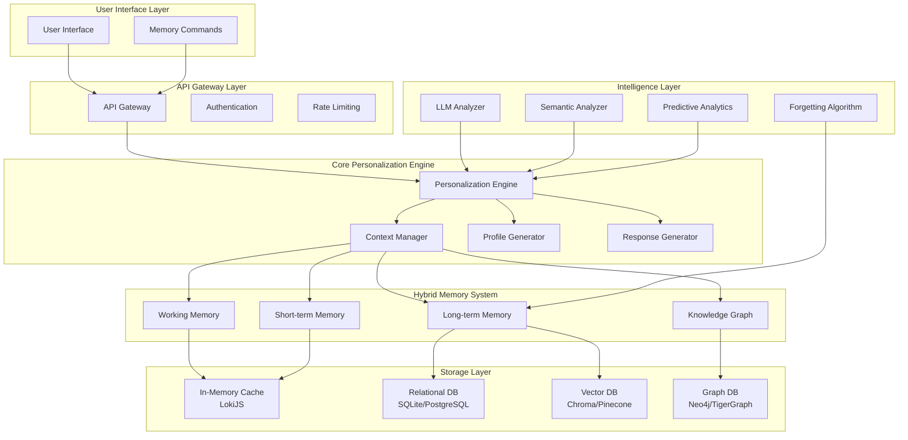

# AIチャット パーソナライゼーションエンジン - システムアーキテクチャ

## 1. 全体アーキテクチャ概要



## 2. コンポーネント詳細設計

### 2.1 Personalization Engine (Core)

**責任**: システム全体の調整と意思決定

```typescript
interface PersonalizationEngine {
  // メイン処理フロー
  processUserMessage(message: UserMessage): Promise<PersonalizedResponse>
  
  // パーソナライゼーション管理
  updateUserProfile(userId: string, interactions: Interaction[]): Promise<void>
  getPersonalizedPrompt(userId: string, context: Context): Promise<string>
  
  // 予測機能
  predictUserNeeds(userId: string): Promise<Prediction[]>
  suggestActions(userId: string, context: Context): Promise<Suggestion[]>
}
```

### 2.2 Hybrid Memory System

#### Working Memory (現在の会話文脈)
- **容量**: 最大10-15の直近メッセージ
- **保持期間**: セッション終了まで
- **用途**: 即座の文脈理解、一貫性維持

#### Short-term Memory (セッション記憶)
- **容量**: セッション内の重要なイベント・情報
- **保持期間**: 24-48時間
- **用途**: 会話の継続性、未解決問題の追跡

#### Long-term Memory (永続的記憶)
- **容量**: 無制限（スマート整理あり）
- **保持期間**: 重要度ベースの動的管理
- **用途**: ユーザーの深い理解、関係性構築

#### Knowledge Graph (構造化知識)
- **構造**: エンティティ関係グラフ
- **内容**: 事実、好み、関係性、目標
- **用途**: 推論、予測、一貫性チェック

### 2.3 動的ユーザープロファイル

```typescript
interface DynamicUserProfile {
  // 基本情報
  userId: string
  displayName?: string
  
  // 性格特性 (Big Five + 独自指標)
  personality: {
    openness: number        // 0-1: 新しい体験への開放性
    conscientiousness: number // 0-1: 誠実性・責任感
    extraversion: number    // 0-1: 外向性
    agreeableness: number   // 0-1: 協調性
    neuroticism: number     // 0-1: 神経症的傾向
    curiosity: number       // 0-1: 学習意欲
    humor: number          // 0-1: ユーモア嗜好
    technicalApproach: number // 0-1: 技術的アプローチ好み
  }
  
  // コミュニケーション設定
  communication: {
    preferredFormality: number    // 0-1: カジュアル ↔ フォーマル
    emotionalExpression: number   // 0-1: 控えめ ↔ 豊か
    responseLength: 'brief' | 'moderate' | 'detailed' | 'adaptive'
    emojiUsage: number           // 0-1: 使用頻度
    reactionStyle: 'immediate' | 'thoughtful' | 'delayed'
  }
  
  // 関係性レベル
  relationshipLevel: {
    stage: 'stranger' | 'acquaintance' | 'friend' | 'close_friend' | 'collaborator'
    trustLevel: number          // 0-1
    intimacyLevel: number       // 0-1
    sharedExperiences: number   // 累積カウント
    conflictHistory: ConflictEvent[]
  }
  
  // 興味・専門分野
  interests: Interest[]
  expertise: ExpertiseArea[]
  goals: Goal[]
  
  // 行動パターン
  behaviorPatterns: {
    activeHours: number[]       // 24時間表記
    responsePatterns: ResponsePattern[]
    questionTypes: QuestionTypeFrequency[]
    helpSeekingBehavior: HelpSeekingPattern
  }
  
  // 学習・成長記録
  learningJourney: {
    skillsAcquired: Skill[]
    progressMarkers: ProgressMarker[]
    challengesFaced: Challenge[]
    achievements: Achievement[]
  }
  
  // メタデータ
  metadata: {
    createdAt: Date
    lastUpdated: Date
    interactionCount: number
    dataConfidence: number      // 0-1: プロファイルの信頼度
    privacySettings: PrivacySettings
  }
}
```

### 2.4 Context-Aware Response Generation

```typescript
interface ContextAwareResponseGenerator {
  // 動的プロンプト構築
  buildDynamicPrompt(
    userMessage: string,
    profile: DynamicUserProfile,
    relevantMemories: MemoryEntry[],
    conversationState: ConversationState
  ): Promise<string>
  
  // 応答スタイル調整
  adjustResponseStyle(
    baseResponse: string,
    profile: DynamicUserProfile,
    context: ResponseContext
  ): Promise<string>
  
  // 予測的提案生成
  generatePredictiveSuggestions(
    profile: DynamicUserProfile,
    currentContext: Context
  ): Promise<Suggestion[]>
}
```

## 3. 高度な機能設計

### 3.1 インテリジェント忘却システム

```typescript
interface ForgettingAlgorithm {
  // 記憶の重要度評価
  evaluateMemoryImportance(memory: MemoryEntry, profile: UserProfile): number
  
  // 時間減衰計算
  calculateTimeDecay(memory: MemoryEntry, currentTime: Date): number
  
  // 記憶整理・要約
  consolidateMemories(userId: string, memories: MemoryEntry[]): Promise<MemoryEntry[]>
  
  // アクセス頻度ベースの保持判定
  shouldRetainMemory(memory: MemoryEntry, accessPattern: AccessPattern): boolean
}
```

### 3.2 予測エンジン

```typescript
interface PredictiveEngine {
  // ユーザー行動予測
  predictNextAction(
    profile: DynamicUserProfile,
    conversationHistory: ConversationState[]
  ): Promise<ActionPrediction[]>
  
  // 情報ニーズ予測
  predictInformationNeeds(
    profile: DynamicUserProfile,
    currentContext: Context
  ): Promise<InformationNeed[]>
  
  // 感情状態予測
  predictEmotionalState(
    profile: DynamicUserProfile,
    recentInteractions: Interaction[]
  ): Promise<EmotionalState>
}
```

### 3.3 ユーザーメモリ管理コマンド

```typescript
interface MemoryManagementCommands {
  // 記憶確認
  '/memory_check': () => Promise<MemorySummary>
  '/what_do_you_know_about_me': () => Promise<UserProfileSummary>
  
  // 記憶編集
  '/update_info <key> <value>': (key: string, value: string) => Promise<UpdateResult>
  '/correct_memory <memory_id> <correction>': (id: string, correction: string) => Promise<void>
  
  // 記憶削除
  '/forget <keyword>': (keyword: string) => Promise<ForgetResult>
  '/delete_memory <memory_id>': (id: string) => Promise<void>
  '/reset_profile': () => Promise<ResetResult>
  
  // プライバシー管理
  '/privacy_settings': () => Promise<PrivacySettings>
  '/set_privacy <level>': (level: PrivacyLevel) => Promise<void>
  
  // 関係性管理
  '/relationship_status': () => Promise<RelationshipSummary>
  '/adjust_formality <level>': (level: number) => Promise<void>
}
```

## 4. データフロー設計

### 4.1 メッセージ処理フロー

```
User Message
    ↓
Context Extraction
    ↓
Relevant Memory Retrieval
    ↓
LLM Analysis (Emotion, Intent, Topic)
    ↓
Profile Update Decision
    ↓
Dynamic Prompt Construction
    ↓
LLM Response Generation
    ↓
Response Style Adjustment
    ↓
Memory Storage Decision
    ↓
Conversation State Update
    ↓
Personalized Response
```

### 4.2 記憶統合フロー

```
New Information
    ↓
Existing Memory Search
    ↓
Conflict Detection
    ↓
    ├─ No Conflict → Direct Storage
    └─ Conflict Found
        ↓
    Confidence Comparison
        ↓
        ├─ High Confidence → Update
        ├─ Low Confidence → User Confirmation
        └─ Equal → Mark as Uncertain
```

## 5. スケーラビリティ設計

### 5.1 マイクロサービス化への準備

- **Profile Service**: ユーザープロファイル管理
- **Memory Service**: 記憶システム管理
- **Analysis Service**: LLM分析処理
- **Personalization Service**: パーソナライゼーションロジック

### 5.2 パフォーマンス最適化

- **キャッシュ戦略**: 多層キャッシュシステム
- **非同期処理**: バックグラウンド記憶整理
- **バッチ処理**: 定期的なプロファイル更新
- **インデックス最適化**: 高速検索のためのインデックス設計

## 6. セキュリティ・プライバシー設計

### 6.1 データ保護

- **暗号化**: 機密情報の暗号化保存
- **匿名化**: 必要に応じたデータ匿名化
- **データ最小化**: 必要最小限のデータ収集
- **自動削除**: 一定期間後の自動データ削除

### 6.2 ユーザーコントロール

- **透明性**: 保存されている情報の完全開示
- **編集権**: ユーザーによる情報修正権
- **削除権**: 忘れられる権利の実装
- **ポータビリティ**: データエクスポート機能

## 7. テスト戦略

### 7.1 ユニットテスト

- 各コンポーネントの独立テスト
- モック使用による依存関係分離
- エッジケースのカバレッジ

### 7.2 統合テスト

- コンポーネント間連携テスト
- メモリ一貫性テスト
- パフォーマンステスト

### 7.3 ユーザビリティテスト

- パーソナライゼーション精度テスト
- 応答品質テスト
- ユーザー満足度測定

このアーキテクチャに基づいて、モジュラーで拡張可能な実装を進めていきます。